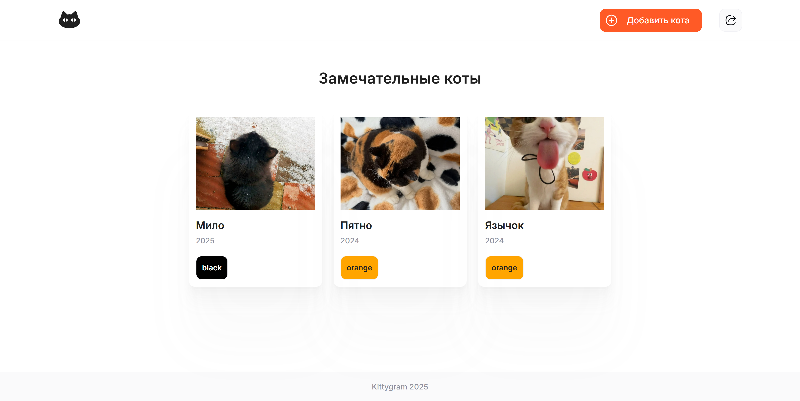

# 🐱 Kittygram 


**Kittygram** — это веб-приложение для публикации и просмотра фотографий котиков.  
Проект завернут в **Docker-контейнеры** и разворачивается с помощью **CI/CD на GitHub Actions**.  

---

## 🐾 Возможности
- Регистрация и авторизация пользователей  
- Добавление карточек с котиками  
- Возможность указывать достижения для питомцев  
- Просмотр чужих и собственных публикаций  
- Автоматический деплой на удалённый сервер через GitHub Actions  

---

## ⚙️ Установка и запуск проекта локально


### 1. Клонирование репозитория

```bash
git clone https://github.com/ekaterina-python-developer/django-drf-kittygram-cicd
cd django-drf-kittygram-cicd
```

### 2. Настройка переменных окружения

В проекте используется файл .env для хранения конфиденциальных данных (пароли, ключи, доступы).

Чтобы запустить проект:

1. Скопируйте файл-шаблон .env.example:

```
cp .env.example .env
```

2. Откройте .env и подставьте свои значения переменных.

Пример содержимого:

```
POSTGRES_USER=kittygram_user
POSTGRES_PASSWORD=kittygram_password
POSTGRES_DB=kittygram_db
DB_HOST=db
DB_PORT=5432
SECRET_KEY=your_django_secret_key
DEBUG=False
ALLOWED_HOSTS=127.0.0.1,localhost,backend,<IP_ВАШЕГО_СЕРВЕРА>
```

### 3. Запуск в контейнерах

```
docker-compose up -d --build
```

### 4. Применение миграций и сбор статики

```
docker-compose exec backend python manage.py migrate
docker-compose exec backend python manage.py collectstatic --no-input
```

### 5. После успешного запуска проект доступен по адресу:

http://localhost:9000/

---

## 🔌 API-примеры (Django REST API)

Для работы с API требуется регистрация и аутентификация по токену.

### Регистрация

```
POST http://localhost:9000/api/users/

Body:

{
    "username": "demo_user",
    "password": "demo_password123"
}

```
### Aутентификация

```
POST http://localhost:9000/api/token/login/

Body:

{
    "username": "demo_user",
    "password": "demo_password123"
}


Ответ:

{
"auth_token": "ваш-токен-здесь"
}

```

---

## 📌 Примеры работы
### Получить список котиков (авторизация по токену):

```
GET http://localhost:9000/api/cats/

Headers:
Authorization: Token ваш-токен-здесь

```

Ответ

```
{
    "count": 3,
    "next": null,
    "previous": null,
    "results": [
        {
            "id": 1,
            "name": "Мило",
            "color": "black",
            "birth_year": 2025,
            "achievements": [
                {
                    "id": 1,
                    "achievement_name": "Милашка"
                }
            ],
            "owner": 1,
            "age": 1,
            "image": "http://localhost:9000/media/cats/images/temp.jpeg",
            "image_url": "/media/cats/images/temp.jpeg"
        },
        ...
    ]
}

```

---

## 🖥 Развёртывание на сервере (Production)

### 1. Подготовка сервера (Ubuntu 24.04/22.04)

```
sudo apt update
sudo apt install -y docker.io docker-compose-v2
sudo usermod -aG docker $USER
```

### 3. Создайте SSH-ключ для GitHub Actions на сервере:

```
# 1. Генерация ключа
ssh-keygen -t ed25519 -C "github-actions" -f ~/.ssh/github_actions -N ""

# 2. Добавление ключа в список разрешенных
cat ~/.ssh/github_actions.pub >> ~/.ssh/authorized_keys

# 3. Установка правильных прав доступа (БЕЗ ЭТОГО SSH НЕ СРАБОТАЕТ)
chmod 700 ~/.ssh
chmod 600 ~/.ssh/authorized_keys
```

### 4. Добавьте Secrets в вашем форке репозитория:

```
SERVER_HOST: IP вашего сервера
SERVER_USER: имя пользователя на сервере
SSH_KEY: Содержимое файла ~/.ssh/github_actions (выведите его командой cat ~/.ssh/github_actions). Копируйте вместе с BEGIN и END!
SECRET_KEY: сгенерируйте через openssl rand -base64 32
DOCKERHUB_USERNAME: ваш логин Docker Hub
DOCKERHUB_TOKEN: ваш токен Docker Hub
TELEGRAM_CHAT_ID: ваш личный ID пользователя в Telegram 
TELEGRAM_BOT_TOKEN: ваш токен Telegram Bot
```

### 5. Запуск деплоя

После настройки секретов:
1. Сделайте push в ветку `main`
2. Или запустите workflow вручную через **Actions → Kittygram CI/CD → Run workflow**

GitHub Actions автоматически:
- ✅ Запустит тесты
- ✅ Соберёт Docker образы
- ✅ Отправит их в Docker Hub
- ✅ Развернёт на вашем сервере
- ✅ Отправит уведомление в Telegram (если настроено)

---

## 🛠️ Используемые технологии

Python 3.9, Django, Django REST Framework
PostgreSQL
React
Nginx
Docker, Docker Compose
GitHub Actions (CI/CD)
Yandex Cloud

---

## 👩‍💻 Разработчик

[Екатерина Воронова](https://github.com/ekaterina-python-developer)
